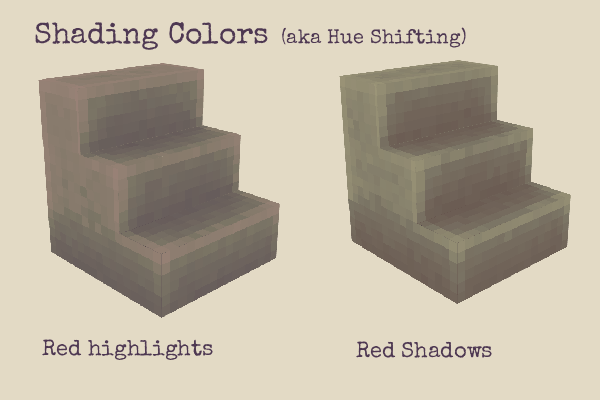
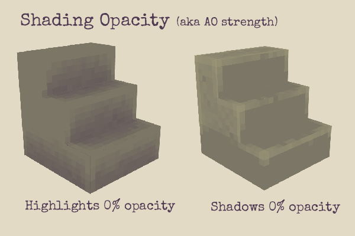
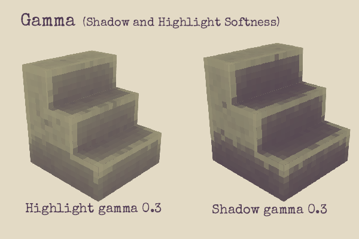
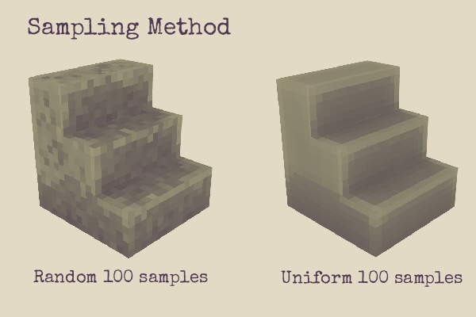
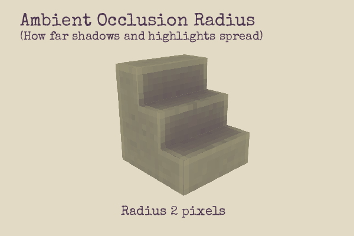
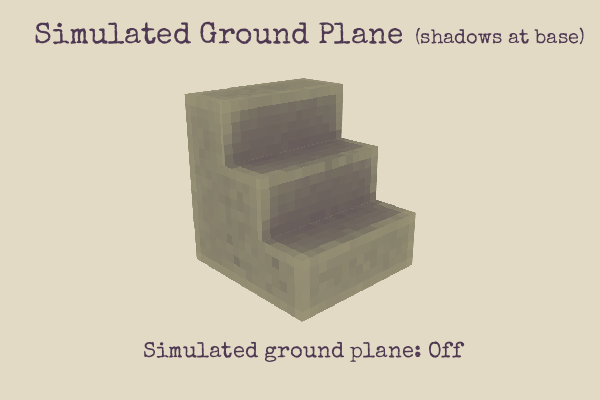
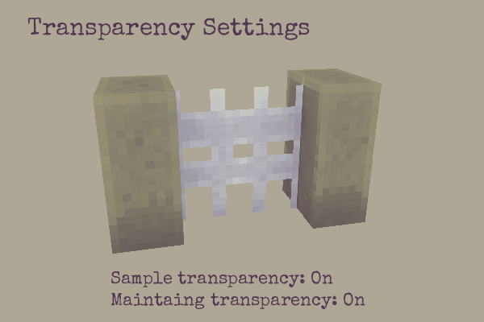

# Blockbench Baked Ambient Occlusion (AO) Plugin

Generate instant shaded textures for your models with one click!

This plugin bakes **ambient occlusion (AO)** directly onto your mesh textures by calculating how much ambient light can reach each pixel. AO simulates how light is blocked in crevices and corners, creating natural depth, shadowing, and worn edge effects.  

By exaggerating this shading, you can replicate how dirt accumulates in recessed areas and how edges of materials like rocks, wood, and metal become worn and lightened over time.

*Before*  


*After*  


## How Ambient Occlusion Works

AO works by casting rays from each pixel on your model’s surface to determine how much ambient light reaches that point:

* **Occluded areas** (crevices, corners, recesses) receive less light → appear darker.
* **Exposed edges** (sharp corners, outward faces) receive more light → appear brighter.

This effect creates realistic depth and helps your model feel more grounded in its environment.

### Gamma Correction

## Installation

1. Clone the repository.  
2. Run:
   
```bash
npm install
npm build
```

This will create a file at `dist\blockbench-baked-ao.js`.

3. In **Blockbench**, go to **Plugins > Load from file** and select the built file.


## Usage

1. Select your mesh (only one mesh at a time is supported).
2. Go to **Tools > Bake Ambient Occlusion**.
3. Adjust your settings in the dialog.
4. Click **Confirm** to bake the effect.


## Settings Reference


### Colors and Opacity

* **Highlight Color & Opacity**
  Defines the color and transparency for well-lit, exposed areas (worn edges, surfaces in full light).

* **Shadow Color & Opacity**
  Defines the color and transparency for occluded, shadowed areas (crevices, corners, dirt-prone areas).




### Gamma Correction

* **Highlight Gamma**
  Controls highlight contrast. Lower = sharper transitions, more contrast. Higher = softer highlights.

* **Shadow Gamma**
  Controls shadow contrast. Higher = softer, more subtle shadows. Lower = sharper, harder shadows.




### AO Strength and Quality

* **Samples per Pixel**
  Determines AO accuracy.

  * 100–500 samples: Quick previews (uniform sampling).
  * 1000+: Final quality (random sampling).

* **Sample Method**

  * **Random**: More accurate, slightly noisier with fewer samples.
  * **Uniform**: Smooth with fewer samples, but may show artifacts.



### Occlusion Radius

* **Ambient Occlusion Radius (Pixels)**
  Controls how far shadows extend:

  * Small radius → tight, localized shadows.
  * Large radius → broader, more distant shadows.
    Use higher values for large models or high-resolution textures.




### Ground Plane Simulation

* **Simulate Ground Plane**
  Adds contact shadows beneath your model for a grounded look.




### Transparency Handling

* **Retain Texture Transparency**
  Preserves your texture’s alpha channel.

* **Sample Texture Transparency**
  Considers semi-transparent pixels when casting rays. More realistic but slower.




## Usage Tips

* **Quick previews**: 100–200 samples, uniform sampling.
* **Final results**: 1000+ samples, random sampling.
* **Large models**: Increase AO radius (12–16 recommended).
* **Detailed textures**: High sample counts + enable texture transparency sampling.
  
## Credit and Acknowledgments

Plugin by **Kai Salmon**.

Massive performance gains powered by [ThreeJS Bounding Volume Hierarchies (BVH)](https://github.com/gkjohnson/three-mesh-bvh) by Garrett Johnson.
